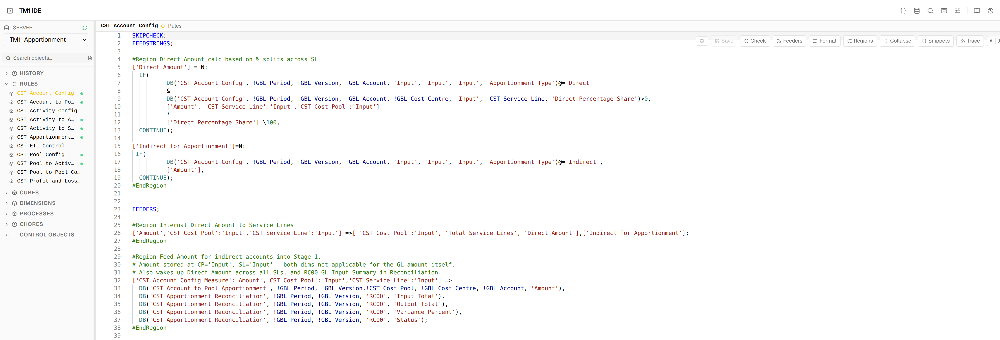

<div align="center">

# TM1 IDE

**A browser-based IDE for IBM Planning Analytics (TM1)**

[](https://nodejs.org)
[](https://opensource.org/licenses/ISC)
[](https://www.ibm.com/products/planning-analytics)
[](https://microsoft.github.io/monaco-editor/)

Edit rules, TI processes, dimensions, subsets, views, chores, and cube data — directly from your browser.  
No TM1 Architect, no Perspectives, no per-server port config.

Connects to TM1 directly over the REST API or through PAW — your choice of adapter.

</div>

---

> [!WARNING]
> **Pre-release — for initial testing only.**
> This project is under active development and is not yet production-ready. Expect rough edges, breaking changes between commits, and features that are incomplete or unstable. Do not use in a production TM1 environment without understanding the risks.

## ⚡ Quick Start

```bash
git clone https://github.com/falconbi/tm1_ide.git
cd tm1_ide
npm install
cp .env.example .env        # direct-v11 only needs PORT=8083; PAW setups need PAW_HOST etc.
npm start                   # → http://localhost:8083
```

> The frontend is pre-built — no build step needed.

---

## 📋 Table of Contents

- [Features](#-features)
- [Setup](#-setup)
- [Keyboard Shortcuts](#-keyboard-shortcuts)
- [Project Structure](#-project-structure)
- [Architecture](#-architecture)
- [Authentication](#-authentication--complete-reference)
- [Deployment Pipeline](#-deployment-pipeline)
- [IBM REST API Reference](#-ibm-rest-api-reference)

---

## 📸 Screenshots

| Rules Editor | TI Editor |
|---|---|
|  |  |

| View Editor — Native | View Editor — MDX |
|---|---|
|  |  |

**Split pane — View + Rules (dark theme)**


---

## ✨ Features

### Editors

| Editor | What it does |
|--------|-------------|
| **Rules Editor** | Monaco editor with TM1 rules syntax highlighting, live validation (CheckRules API) + static analysis (arg counts, keyword validity, line-accurate squiggles), **Check Now** button with green/red pass/fail glow, code formatter (3 structure presets), **#Region/#EndRegion folding**, lineage trace panel, **cell calculation trace** (shows full rule chain for any cell), snippet library, **Feeders** button (`tm1.CheckFeedersForRules`), **post-save reference check** (dead cube/dimension warnings as amber toasts) |
| **TI Editor** | Four-tab editor (Prolog / Metadata / Data / Epilog), parameter editor, datasource editor with CSV file upload to TM1 server, run with output log, **error log viewer** (reads TM1 `.log` file inline after errors), static analysis (IF/WHILE/FOR/NEXT block structure, arg counts), **block folding**, debugger, snippets, pattern generators, **post-save reference check**, **Validate** toolbar button — tests every `TI_CATALOG` function against the live TM1 server |
| **TI Debugger** | Set breakpoints in any section, capture variable values at each breakpoint, watch panel, section-by-section execution |
| **Dimension Editor** | Hierarchy tree with CRUD, attribute grid, element search, bulk CSV import. Per-column **→A** button converts String attributes to Alias in one click (values preserved). **Format picker** for the Format attribute with colour swatch support |
| **Subset Editor** | MDX code view + visual element tree, static/MDX save, MDX preview |
| **View Editor** | Native and MDX view builder, cell grid with inline writeback, **auto-refreshes when rules for the same cube are saved**, Feeders check, **cell right-click → Trace** side drawer |
| **Guided MDX Builder** | Axis-by-axis view builder, subset filter builder, MDX execution |
| **Chore Editor** | Schedule editor, step list, activate/deactivate/execute on demand |
| **Cube Editor** | Create and delete cubes, dimension assignment |
| **SQL Editor** | External database queries (SQL Server, PostgreSQL, MySQL, SQLite), schema browser, saved queries, post SQL as TI datasource |
| **MDX Sandbox** | Ad-hoc MDX execution with result grid |
| **Deploy Panel** | 5-step wizard: Diff → Package → Risk (drift check + BLOCKER/WARNING/INFO) → Approve → Deploy |
| **Deploy History** | Permanent archive of every deployment — approval record, manifest, results, and pre/post target snapshots with inline diff viewer |

### 🗓️ Period Builder

A wizard that generates a fully structured, production-ready Period dimension — elements, hierarchy, all attributes, and the three TI processes that maintain it — without writing a single line of code.

#### What it builds

For any fiscal year configuration (calendar year, April start, July start, etc.) across any year range, it generates:

#### Element structure

| Element type | Example | Purpose |
| --- | --- | --- |
| Monthly leaf | `2025-04` | Source data and reporting periods |
| FY consolidation | `FY2026` | 12-month fiscal year rollup |
| OBL leaf | `2026 OBL` | Opening balance — separate from actuals |
| YTD consolidation | `YTD FY2026 P06` | Jan–Jun accumulation for FY2026 |
| YTG consolidation | `YTG FY2026 P06` | Jul–Mar remaining months for FY2026 |
| LTD consolidation | `LTD FY2026 P06` | OBL + YTD P06 |
| Umbrella C | `All Periods`, `All FY`, `All YTD` | Cross-FY aggregations |
| Rolling (optional) | `Rolling 12`, `Rolling 6`, `Rolling 3` | Forward-rolling windows from current period |

#### Attributes per month leaf — all computed, none entered manually

| Attribute | Type | Example |
| --- | --- | --- |
| `Caption` | Alias | `Apr-25` |
| `Long Name` | String | `April 2025` |
| `Fin Year` | String | `FY2026` |
| `First Period` | String | `2025-04` |
| `Last Period` | String | `2026-03` |
| `Previous Period` | String | `2025-03` |
| `Next Period` | String | `2025-05` |
| `Calendar Year` | Numeric | `2025` |
| `Calendar Month` | Numeric | `4` |
| `Days in Period` | Numeric | `30` |
| `Period Start Serial` | Numeric | `45751` (Excel/TM1 serial) |
| `Period End Serial` | Numeric | `45780` |
| `Is Current Period` | String | `Y` / blank |
| `YTD` | String | `YTD FY2026 P01` |
| `YTG` | String | `YTG FY2026 P01` |
| `LTD` | String | `LTD FY2026 P01` |
| `Period Type` | String | `Month` / `OBL` |

#### Three generated TI processes

| Process | Parameters | What it does |
| --- | --- | --- |
| `{dim}.Build` | `pFirstFY`, `pLastFY`, `pFYStartM`, `pCurrentPeriod` | Creates (or extends) the dimension — elements, hierarchy, attributes. Idempotent — safe to re-run, only appends, never deletes. |
| `{dim}.Refresh Subsets` | `pCurrentPeriod`, `pFYStartM` | Destroys and recreates all named public subsets relative to the current period. Run monthly from a chore after rollover. |
| `{dim}.Rollover` | `pCurrentPeriod`, `pPeriod` (optional) | Advances `Is Current Period` one month forward (or jumps to a specific period if `pPeriod` is supplied), then calls `.Refresh Subsets`. |

#### Wizard inputs

- Dimension name, FY start month, first/last FY
- Year format (`FY2026` / `FY2025` / `2026`), month format (`YYYY-MM` / `Mon-YY`), caption format, long name format
- Include Total member, Include Is Current Period attribute
- Subset selector — choose which of 16 named subsets to generate (All Periods, All FY, Current FY, YTD, YTG, LTD, Rolling 12/6/3, etc.)
- Live FY boundary preview before generating — shows each FY label mapped to its calendar months

#### Subset selector

16 named subsets, each rebuilt by `.Refresh Subsets`. Eight are on by default:

| Subset | Default | Requires current period |
| --- | --- | --- |
| All Periods | ✓ | |
| All FY | ✓ | |
| Current Period | ✓ | ✓ |
| Current FY | ✓ | ✓ |
| Prior FY | ✓ | ✓ |
| YTD | ✓ | ✓ |
| YTG | ✓ | ✓ |
| LTD | ✓ | ✓ |
| Prior Period | | ✓ |
| Next FY | | ✓ |
| Prior YTD / YTG / LTD | | ✓ |
| Rolling 12 / 6 / 3 | | ✓ |

Subsets that require `Is Current Period` grey out in the selector if that attribute is not included.

> The dimension design is also available as a standalone reference — see [tm1_period_dimension](https://github.com/falconbi/tm1_period_dimension) for the Python builder and TI source files.

---

### 🔍 Cell Trace — Right-Click → Trace

Right-clicking any cell in a view opens a popup with the cube name and element strip. Clicking **Trace** opens a 440px right-side drawer:

- **Rule statements** — each `DB()`, `ATTRN()`, `ATTRS()` call annotated with resolved live values
- **Components** — type badge (RULE / CONSOLIDATED / BASE / FEEDER) and current value per component
- **Drill-down navigation** — click any same-cube component to drill in; breadcrumb stack + Back button

### 🔎 Used In — Impact Analysis

The **Used In** panel in the View Editor shows every place in your TM1 environment that references the current view or its parent cube. Click the **Used In** button in the toolbar to expand it.

The panel has two sections:

#### TI Processes

Scans all TI process code on the connected server for references to the cube or view name. Lists every process that contains a match — useful for understanding what automation will be affected before you rename or delete an object. Works with all connection adapters (`direct-v11`, `paw-native`).

#### PAW Books

Walks the PAW content tree (`/shared` and `/users`) looking for dashboards and workbenches that embed the current view. Each matching book is shown as a clickable link that opens it directly in PAW.

> **Requires paw-native.** PAW Books uses the `pacontent/v1` workspace API — a PAW-specific endpoint that has no equivalent in the TM1 REST API. When the IDE is connected via `direct-v11` (no PAW), the PAW Books section is silently suppressed. The TI Processes section still works regardless of adapter.

---

### 🎨 Cell Formatting

Add a `Format` attribute (String type) to your measure dimension to control display in the View Editor:

| Format value | Effect |
| ------------ | ------ |
| `#,##0` | Integer with thousands separator |
| `#,##0.0` | One decimal place |
| `#,##0.00` | Two decimal places |
| `$#,##0` | Dollar with thousands separator |
| `#,##0.0%` | Percentage — store `0.101` → display `10.1%` |
| `#,##0.0%/100` | Percentage — store `10.1` → display `10.1%` |
| `@` | String cell — cyan (dark) / teal (light) |
| `@blue` / `@#ff0000` | String cell with named or hex colour |

### 🔎 Explorer

Browse and manage all TM1 objects: cubes, dimensions, subsets, views, processes, chores. Full CRUD for every object type — inline `+` buttons to add objects without leaving the explorer.

### 🗂️ Tabs & Split Panes

- Drag to reorder tabs within a group
- Right-click any tab: Split Right, Split Down, Move to other pane, Close others, Close to right
- Arrow button on tab hover — instantly send a tab to the other pane
- Toggle horizontal/vertical split without closing panes — direction persisted across sessions

### 🔎 Cross-Object Search

`Ctrl+Shift+F` — full-text search across all rules and TI process code on the connected server simultaneously.

### 💡 Autocomplete & Intelligence

Context-aware Monaco autocomplete across all three TM1 languages (Rules, TI, MDX):

- **Cube name / dimension name** completions with full snippet expansion and dimension tab stops
- **Function keyword completions** — correct parameter signatures from the catalog
- **Signature help** — triggered on `(`, shows param names and descriptions; active parameter highlights as you type
- **Hover docs** — hover any function name for description, param list, return type, V11/V12 compat, deprecated warnings

### 📚 Function Catalog

<details>
<summary>The intelligence layer behind completions, validation, and hover docs — click to expand</summary>

The function catalog drives autocomplete, signature help, static validation, and hover documentation. It is fully transparent and user-editable via the **book icon** in the header.

#### Catalog files

| Catalog | File | Language | Purpose |
|---------|------|----------|---------|
| `RULES_CATALOG` | `client/src/lib/tm1-completion.js` | Rules | Rich schema entries — drives completions + `rules-validator.js` |
| `TI_CATALOG` | `client/src/lib/tm1-completion.js` | TI | Rich schema entries — drives completions + `ti-validator.js` |
| `TM1_FUNCTIONS` | `client/src/lib/tm1-functions.js` | Rules + TI | Named-param signature help, Monarch highlighting |
| `MDX_CATALOG` | `client/src/lib/tm1-mdx-catalog.js` | MDX | Category-grouped MDX functions with templates |

#### Rich catalog schema

```js
DIMSIZ: {
  params:      ['dimname'],
  returnType:  'numeric',
  description: 'Returns the number of elements in a dimension.',
  compat:      'both',      // 'both' | 'v11' | 'v12'
  deprecated:  null,
  isStatement: false,
}

CELLPUTN: {
  params:      ['value', 'cubename', 'element*'],  // '*' = variadic
  returnType:  'void',
  description: 'Writes a numeric value to a cube cell.',
  compat:      'both',
  deprecated:  null,
  isStatement: true,        // cannot appear in an expression
}
```

#### What validators catch

- Unknown function name → `error` squiggle
- Wrong argument count → `error` squiggle
- `deprecated` set → `warning` squiggle with the deprecation message
- TI-only function used in Rules → `error`

#### Catalog Admin UI

The **book icon** in the header opens the Function Catalog — four tabs: TI Functions | Rules Functions | MDX Functions | Naming / Formatter.

- Edit compat, add functions, see deprecated warnings
- **Validate** button — tests every catalog entry against the live TM1 server (creates a temp process per function, deletes immediately). Results overlay ✓ / ✗ per row.
- User overrides persist to `config/function-catalog-overrides.json` — built-in catalog is never modified

</details>

---

## 🚀 Setup

### Prerequisites

- **Node.js 20+** — [nodejs.org](https://nodejs.org)
- One or more TM1 servers with `HTTPPortNumber` set in `tm1s.cfg` (for direct connection), **or** a PAW instance (V11 native auth / V12 Authentik SSO)

### 1. Install

```bash
git clone https://github.com/falconbi/tm1_ide.git
cd tm1_ide
npm install
```

> The frontend is pre-built — no `client/` install or build step needed.

### 2. Configure

#### Option A — Direct TM1 (no PAW required) ✅ Recommended for home lab / dev

This is the simplest setup. The IDE connects directly to the TM1 admin server — no PAW needed.

**Before you start — check your `tm1s.cfg`:**

The IDE talks to TM1 over HTTP. You need `HTTPPortNumber` to be set in your server's `tm1s.cfg` file (usually found in the TM1 server's data directory). If it's not there, add it:

```ini
HTTPPortNumber=5895
```

Restart the TM1 server after adding it. You can use any free port — `5895` is the IBM default for the admin server.

**Then edit `config/servers.json`:**

```json
{
  "adminHosts": [
    {
      "name": "MyLab",
      "url": "http://192.168.x.x:5895",
      "adapter": "direct-v11",
      "loginServer": "MyTM1Server",
      "username": "admin",
      "password": "your_password",
      "servers": ["MyTM1Server", "AnotherServer"]
    }
  ]
}
```

| Field | What to put here |
|-------|-----------------|
| `url` | IP address of the Windows machine running TM1, followed by the `HTTPPortNumber` |
| `username` / `password` | A TM1 admin account (must be in the `ADMIN` group on the TM1 server) |
| `loginServer` | The name of the TM1 server that the IDE uses to authenticate users — must be one of the names in `servers` |
| `servers` | The names of all your TM1 servers as they appear in Cognos Configuration — these are what show up in the IDE's server selector |

Create a minimal `.env` (only the port is needed):

```env
PORT=8083
```

---

#### Option B — Via PAW (Planning Analytics Workspace)

For environments where TM1 is accessed through PAW.

```bash
cp .env.example .env
```

Edit `.env`:

```env
PAW_HOST=http://192.168.x.x
PAW_USERNAME=admin
PAW_PASSWORD=your_password
PAW_LOGIN_SERVER=Production
PORT=8083

# Optional: AI-powered MDX generation
ANTHROPIC_API_KEY=sk-ant-...
```

Edit `config/servers.json`:

```json
[
  { "name": "Production" },
  { "name": "Development" }
]
```

> See [Authentication](#-authentication--complete-reference) for multi-host and advanced adapter setups.

### 3. Run

```bash
npm start
```

Open **[http://localhost:8083](http://localhost:8083)**

<details>
<summary>Development mode (Vite HMR)</summary>

```bash
# Terminal 1 — backend
npm start

# Terminal 2 — frontend with hot reload
cd client && npm install && npm run dev
```

Open **http://localhost:5173**

After making client changes, rebuild for production:

```bash
cd client && npm run build
cp dist/assets/index-*.js ../static/assets/
cp dist/assets/index-*.css ../static/assets/
cp dist/index.html ../static/index.html
```

</details>

---

## ⌨️ Keyboard Shortcuts

Keyboard shortcuts are available throughout the IDE. Press `F1` or `Ctrl+Shift+K` inside the app to open the full shortcut reference.

---

## 📁 Project Structure

```
tm1_ide/
├── server.js                          # Express backend — all API routes
├── core/
│   ├── tm1_client.js                  # TM1 REST client — all API calls go through here
│   ├── adapter_registry.js            # Selects adapter per request, resolves server URLs
│   ├── paw_connect.js                 # Session store + PAW cookie-jar auth (paw-native)
│   ├── change_log.js                  # Change Set tracking — logs every save to audit trail
│   ├── sql_client.js                  # External SQL connections (MSSQL/PG/MySQL/SQLite)
│   ├── mdxBuilder.js                  # MDX query construction helpers
│   └── adapters/
│       ├── direct_v11.js              # Direct TM1 REST — Basic Auth, no PAW
│       ├── paw_native.js              # PAW proxy — cookie jar + CSRF header
│       └── paw_oauth2.js              # PAW proxy — Authentik/OAuth2 machine credential
├── client/                            # React + Vite frontend source
│   └── src/
│       ├── App.jsx                    # Root layout, global keyboard handlers
│       ├── store/                     # Zustand: tabs, groups, server, UI state
│       ├── hooks/useApi.js            # All TanStack Query data hooks
│       ├── components/                # One file per editor/panel
│       └── lib/
│           ├── tm1-completion.js      # RULES_CATALOG + TI_CATALOG (rich schema, arg counts)
│           ├── tm1-functions.js       # TM1_FUNCTIONS (Monarch highlighting, signature help)
│           ├── tm1-mdx-catalog.js     # MDX_CATALOG (category-grouped MDX functions)
│           ├── rules-validator.js     # Static analysis for Rules
│           ├── ti-validator.js        # Static analysis for TI
│           ├── mdx-validator.js       # Static analysis for MDX
│           ├── ti-debugger.js         # Breakpoint injection + capture parsing
│           ├── ti-interpreter.js      # Client-side TI execution simulator
│           ├── ti-patterns.js         # TI code pattern generators
│           ├── tm1-snippets.js        # TI and Rules snippet library
│           └── formatters/            # Rules formatter: tokenizer, AST, presets
├── tools/
│   └── tm1deploy/                     # Deploy CLI (optional — UI pipeline does the same)
│       ├── bin/tm1deploy.js           # Entry point: seed / diff / package / risk / deploy
│       └── src/                       # snapshot.js, diff.js, packager.js, risk.js, deployer.js
├── static/                            # Pre-built frontend (committed, served directly)
├── config/
│   ├── servers.json                   # TM1 server list + adapter config
│   ├── forge.json                     # Workspace state (open tabs, server, split direction)
│   ├── function-catalog-overrides.json # User-editable catalog additions/corrections
│   ├── sql-connections.json           # External SQL connection definitions
│   └── sql-queries.json               # Saved SQL queries
└── docs/
    ├── Planning Analytics.postman_collection.json  # Full IBM REST API reference
    ├── CONNECTION_ARCHITECTURE.md     # Adapter pattern deep-dive
    ├── DEPLOYMENT.md                  # Deploy pipeline internals
    └── ADAPTER_INTERFACE.md           # Adapter contract reference
```

---

## 🏗️ Architecture

```
# Option A — direct-v11 (recommended)
Browser  ←→  Express (server.js)  ──Basic Auth──▶  TM1 Server

# Option B — paw-native / paw-oauth2
Browser  ←→  Express (server.js)  ──Cookie+CSRF──▶  PAW  ──▶  TM1 Server
```

- `core/adapter_registry.js` selects the right adapter from `servers.json` on every request
- `core/tm1_client.js` wraps every TM1 API call — routes never call the API directly
- The frontend uses **TanStack Query** for all server state — all cache keys include the server name

---

## 🔐 Authentication — Complete Reference

This section documents everything about how authentication works in the IDE — the session layer that is common to all setups, the three adapter paths, TM1's own auth mechanics, and the one feature that requires PAW regardless of adapter.

---

### The IDE Session Layer

The session system is adapter-agnostic at the frontend. The browser never talks to TM1 or PAW directly — all calls go through the Express backend, which manages auth on behalf of each user.

**Session lifecycle:**

1. User submits username + password to `POST /api/auth/login`
2. Server creates a session entry in an in-memory Map (in `core/paw_connect.js`): `Map<uuid-token, { username, password, session, expiry }>`
3. UUID token returned to browser → stored in `localStorage` as `tm1-token`
4. Browser sends `x-ide-token: <uuid>` header on **every** subsequent API request
5. Server middleware validates the token on every `/api/*` request (except `/api/auth/login` and `/api/auth/logout`)
6. Sessions expire after **10 minutes** (configurable via `SESSION_TTL` in `paw_connect.js`)
7. On expiry: the next request silently re-authenticates using the stored credentials and continues

What the `session` field contains differs by adapter:

| Adapter | `session` value |
|---------|----------------|
| `direct-v11` | `null` — credentials live in the Map, re-encoded as Basic Auth per request |
| `paw-native` | Live axios instance with a `tough-cookie` jar holding the PAW SSO session |
| `paw-oauth2` | Not per-user — a shared OAuth2 token cached at the connection level |

**Multi-user isolation:**

Multiple users can be logged in simultaneously. Each login produces an independent Map entry keyed by its own UUID. There is no shared state between users — each gets their own credential store, their own PAW session (if applicable), and their own active **Change Set** per server so audit trails never collide.

---

### Option A — direct-v11 (HTTP Basic Auth)

Recommended for home lab and dev environments. Connects directly to the TM1 Admin Server — no PAW required.

#### What "direct-v11" means

TM1 has exposed an HTTP REST API since V11 (Planning Analytics 2.0.x). Every TM1 installation has an **Admin Server** process that listens on `HTTPPortNumber` (default `5895`, set in `tm1s.cfg`). This admin server:

- Serves `GET /api/v1/Servers` — a list of all TM1 server instances it manages, including each server's own HTTP port and whether it uses SSL
- Acts as a discovery endpoint so the IDE can resolve the individual REST API base URL for each named server

Once resolved, all subsequent TM1 API calls go directly to the individual server's port — the admin server is not involved again (the URL is cached).

#### direct-v11 Login Flow

1. User enters TM1 username + password in the IDE login screen
2. `POST /api/auth/login` — server calls `createDirectSession(username, password)`:
   - Credentials stored in session Map with `session: null`
   - **Immediate credential probe**: `GET /api/v1/Configuration` on the `loginServer` — a live TM1 call to verify credentials before issuing a token
   - If TM1 rejects → session deleted → `401` returned with `"Login failed — check your TM1 credentials"`
   - If TM1 accepts → UUID token returned to browser

#### direct-v11 Per-Request Auth

On every outbound TM1 call, `DirectV11Adapter._headers()` encodes the session credentials:

```
Authorization: Basic base64(username:password)
```

Sent on every HTTP request. No persistent connection, no cookie, no CSRF token. TM1 validates the credentials on each call independently.

**LDAP/AD-integrated TM1 servers:**  
If your TM1 server uses CAM (Cognos Access Manager) with an LDAP or Active Directory namespace, add `"camNamespace": "YourNamespace"` to the admin host entry in `servers.json`. The adapter sends it as a `CAMNamespace` header alongside `Authorization`, which tells TM1 to validate the credentials against the named namespace rather than TM1 native auth.

#### URL resolution

The `adapter_registry.js` resolves each server's base URL on first use:

```
GET http://<adminHost>:<HTTPPortNumber>/api/v1/Servers
→ find entry where Name matches serverName
→ build base URL: http://<adminHost>:<server.HTTPPortNumber>
```

The resolved URL is cached in `_urlCache`. All TM1 API calls then go to:

```
http://<server-ip>:<server-port>/api/v1/<path>
```

#### Credential resolution priority

`adapter_registry.js` prefers the **logged-in user's credentials** (from `getSessionCredentials(ideToken)`) over the static credentials in `servers.json`. This means:

- If a user logs in with their own TM1 username/password, all their API calls use those credentials
- If `getSessionCredentials` returns null (e.g. an unauthenticated internal call), it falls back to the `username`/`password` fields in `servers.json`

#### Access control

TM1 enforces access server-side based on `}ClientGroups` membership — exactly as it does in TM1 Architect or Perspectives. The IDE makes no access decisions of its own. What a user can read or write in the IDE reflects precisely what their TM1 groups allow.

---

### Option B — paw-native (PAW Cookie Session)

For environments where TM1 is accessed through Planning Analytics Workspace. PAW acts as an authenticated reverse proxy — the IDE authenticates with PAW, and PAW forwards all TM1 REST API calls to the underlying TM1 server.

#### What PAW is

Planning Analytics Workspace (PAW) is IBM's web analytics platform for TM1. It runs as a separate service (typically on port 80/443) and exposes the TM1 REST API through its own auth layer at:

```
${PAW_HOST}/api/v0/tm1/${serverName}/api/v1/${path}
```

All TM1 REST API endpoints are available through this proxy URL — the path after `/api/v1/` is identical to what you would call directly. PAW adds its own session validation layer on top.

#### paw-native Login Flow

1. User submits username + password
2. `createSession(username, password)` POSTs to PAW's login form:

   ```http
   POST ${PAW_HOST}/login/form/
   Content-Type: application/x-www-form-urlencoded

   username=...&password=...&mode=basic
   ```

3. PAW validates the credentials against the configured **TM1 Login Server**
4. On success: PAW sets a `ba-sso-csrf` cookie (a CSRF prevention token)
5. The IDE captures the full response cookie jar using `axios-cookiejar-support` + `tough-cookie` — the cookie jar persists for the life of the session
6. UUID token returned to browser

If PAW rejects the login (wrong credentials, unreachable server), the `ba-sso-csrf` cookie is never set. `_login()` throws `"PAW login failed — ba-sso-csrf cookie not set"`, which the login route catches and returns as `401`.

#### paw-native Per-Request Auth

On every TM1 API call:

1. `getCachedPawSession(token)` retrieves the axios instance with its cookie jar — re-authenticates silently if the 10-minute TTL has expired
2. `getCSRF(session)` reads the current `ba-sso-csrf` cookie value from the jar
3. Request sent with the cookie jar (all PAW cookies included automatically) plus an explicit CSRF header: `ba-sso-authenticity: <csrf-value>`
4. PAW validates the session and CSRF token, then proxies the call to TM1

#### TM1 Login Server

PAW validates all logins against exactly one TM1 server — the **TM1 Login Server** configured in the PAW Admin Console under _Configuration → TM1 Login Server URI_. This is the server that holds the master user list for PAW authentication.

- Users must exist in `}Clients` on this specific server to log into PAW (and therefore the IDE)
- Users must have logged into the PAW workspace directly at least once to have an active workspace profile
- Set `loginServer` in `servers.json` (or `PAW_LOGIN_SERVER` in `.env` for the plain-array format) to match the PAW Login Server name — the IDE uses this to tell the login screen which server is the authority

Once authenticated, the PAW session grants access to any server registered under that PAW instance — the user's `}ClientGroups` on each individual server still control what they can actually do.

#### User management

With `paw-native`, the shield icon in the app header opens the **User Management** panel. This provisions users directly via the TM1 REST API through PAW:

- List, create, update, and delete `}Client` elements
- Set passwords and assign `}ClientGroup` memberships
- Changes are live — no TM1 server restart required

---

### Option C — paw-oauth2 (Authentik / OAuth2)

For PAW V12 environments using Authentik as the identity provider.

#### Key difference from paw-native

`paw-oauth2` uses a **machine credential** — a single client ID + secret that represents the IDE as a service account. There are no per-user PAW sessions. The `PawOAuth2Adapter` fetches an OAuth2 access token using the machine credential and caches it per connection (`{connection.name}::{serverName}`). The token is refreshed automatically when it expires.

This means all IDE users' TM1 calls are made under the service account identity from PAW's perspective. TM1 still applies `}ClientGroups` access control server-side — the service account must have the appropriate group memberships for the operations the IDE performs.

#### Configuration

```json
{
  "connections": [
    {
      "name": "prod",
      "adapter": "paw-oauth2",
      "pawHost": "http://192.168.x.x",
      "loginServer": "Production",
      "client_id": "tm1-ide",
      "client_secret": "your_secret",
      "servers": ["Production"]
    }
  ]
}
```

---

### How the Adapter Registry Selects an Adapter

`core/adapter_registry.js` runs on every API request. Selection order:

1. Load `config/servers.json`
2. Search `adminHosts[]` — if the requested `serverName` appears in `h.servers`, use `DirectV11Adapter` with that admin host's URL and credentials
3. Search `connections[]` — if the requested `serverName` appears in `c.servers` (or equals `c.name`), use the adapter named by `c.adapter`
4. If `servers.json` is a plain array (legacy format): wrap all servers in a single implicit `paw-native` connection using `PAW_HOST` from `.env`

The default adapter type is determined by `getDefaultAdapterType()` which reads the first entry in `adminHosts` or `connections`. The login route uses this to decide whether to call `createDirectSession` (direct-v11) or `createSession` (PAW-based).

---

### PAW Books — The One PAW-Specific Feature

The **Used In → PAW Books** panel in the View Editor is the only feature in the IDE that requires a live PAW connection regardless of how you have TM1 auth configured.

It calls PAW's content management API:

```
GET ${PAW_HOST}/pacontent/v1/Assets(path='...')/Assets
```

This recursively walks the PAW content tree under `/shared` and `/users`, finding dashboards and workbenches. For each book found, it fetches the full content JSON and inspects the embedded TM1 view references (`PAProperties.tm1`, `Models_internal.data.parentStore`). Books that reference the current cube and view are returned as clickable links.

This API is a PAW workspace endpoint — it has no equivalent in the TM1 REST API v1. When the IDE is connected via `direct-v11` (no PAW), the endpoint immediately returns `{ books: [], pawUnavailable: true }` and the PAW Books section is silently suppressed in the UI. The **TI Processes** half of Used In continues to work via the standard TM1 REST API regardless of adapter.

---

### Connection Adapters — Quick Reference

| Adapter | `servers.json` key | Auth mechanism | PAW required | Credential scope |
|---------|-------------------|----------------|--------------|-----------------|
| `direct-v11` | `"adapter": "direct-v11"` | HTTP Basic Auth, per-request | No | Per-user (falls back to servers.json static creds) |
| `paw-native` | `"adapter": "paw-native"` | PAW cookie jar + CSRF header | Yes | Per-user PAW session |
| `paw-oauth2` | `"adapter": "paw-oauth2"` | OAuth2 machine credential | Yes | Shared service account |

<details>
<summary>Advanced servers.json — mixing adapters and PAW hosts</summary>

```json
{
  "connections": [
    {
      "name": "paw-prod",
      "adapter": "paw-native",
      "pawHost": "http://192.168.1.37",
      "loginServer": "Production",
      "servers": ["Production", "Development"]
    }
  ],
  "adminHosts": [
    {
      "adapter": "direct-v11",
      "url": "http://192.168.1.10:5895",
      "loginServer": "Staging",
      "username": "admin",
      "password": "your_password",
      "servers": ["Staging"]
    }
  ]
}
```

In this configuration, `Production` and `Development` route through PAW (`paw-native`), while `Staging` connects directly via `direct-v11`. The adapter registry resolves the correct path on every request based on which server is being accessed.

</details>

### Auth API Reference

| Method | Path | Purpose |
|--------|------|---------|
| `POST` | `/api/auth/login` | Authenticate. `direct-v11`: stores credentials + probes TM1. `paw-native`: authenticates with PAW form login. Returns `{ token, username }`. |
| `POST` | `/api/auth/logout` | Invalidates the session token. Subsequent requests with that token return `401`. |
| `GET` | `/api/config` | Returns `{ loginServer }` — used by the login screen to pre-fill the server selector. |
| `GET` | `/api/users` | List all TM1 `}Client` elements on the login server. |
| `POST` | `/api/users/provision` | Create a user with password and group assignments. |
| `PATCH` | `/api/users/:name` | Update user properties. |
| `DELETE` | `/api/users/:name` | Delete a user from `}Clients`. |
| `POST` | `/api/users/:name/password` | Reset a user's TM1 password. |
| `GET` | `/api/paw/book-usage` | List PAW workbooks that embed a given view. Returns `{ books: [], pawUnavailable: true }` when no PAW session is available. |

---

## 🚢 Deployment Pipeline

<details>
<summary>Built-in CI/CD for promoting changes from Dev to Prod — click to expand</summary>

Every save in the IDE is logged to a **Change Set** (named work session). The pipeline compares your changes against a baseline snapshot of **Prod** — not Dev — so only objects that have actually changed relative to Prod get packaged.

### Flow

```
  ① Seed baseline     ② Align Dev         ③ Work in Dev
    from Prod    ──→    to match Prod  ──→   via change set
    (snapshot)          (provision)          (IDE tracks)
                                                  │
                                                  ▼
  ④ Diff Dev vs       ⑤ Drift re-check     ⑥ Risk + Deploy
    Prod baseline ──→   Prod hasn't    ──→   to Prod
    (package)           changed?
```

### Steps

**① Seed** — snapshot Prod's object state into `.tm1baseline/snapshot.json`:
```bash
node tools/tm1deploy/bin/tm1deploy.js seed Production
```

**② Work** — click the **Clock** icon → name the change set → **Start**. Green dots appear in the Explorer sidebar on every changed object.

**③ Diff & Package** — hover the change set row in the Change Sets panel → click the green **Rocket**. The Deploy Panel opens:

| Outcome | Meaning |
|---------|---------|
| `MATCH` | Changed in Dev, verified against baseline — ready to deploy |
| `NEW` | Object exists on Dev but not in baseline |
| `DRIFT` | Dev's current state differs from the last IDE save |
| `UNCHANGED` | Same as baseline — nothing to deploy |
| `MISSING` | In baseline but not found on Dev — possibly deleted |

**④ Risk** — two phases run automatically:
1. **Drift check** — fetches current state from Prod and compares to baseline. Any drift **blocks deployment** until you re-seed.
2. **Risk analysis** (if Phase 1 is clean) — syntax, dependencies, structural impact → `BLOCKER` / `WARNING` / `INFO`

**⑤ Approve** — a named approver signs off with optional notes. Required before deployment unlocks.

**⑥ Deploy** — objects written in dependency order: attributes → dimensions → cubes → picklist cubes → rules → subsets → views → processes. Pre/post snapshots captured and stored in Deploy History.

### CLI (optional)

```bash
node tools/tm1deploy/bin/tm1deploy.js seed <prod-server>
node tools/tm1deploy/bin/tm1deploy.js diff <session-name>
node tools/tm1deploy/bin/tm1deploy.js package <session-name>
node tools/tm1deploy/bin/tm1deploy.js risk <package-dir> <target-server>
node tools/tm1deploy/bin/tm1deploy.js deploy <package-dir> <target-server>
```

</details>

---

## 📖 IBM REST API Reference

The full IBM Planning Analytics REST API is documented in [`docs/Planning Analytics.postman_collection.json`](docs/Planning%20Analytics.postman_collection.json). Covers: Dimensions, Cubes, Processes, Chores, Views/MDX, Subsets, Sessions, Transactions, Jobs, ErrorLogFiles, Metrics, Configuration, File Management, GIT integration, and PAW Workspace management.

---

## 📊 Status

Active development. Core IDE features are complete and production-stable.

---

<div align="center">
Built for the IBM Planning Analytics community · <a href="https://github.com/falconbi/tm1_ide/issues">Report an issue</a>
</div>
