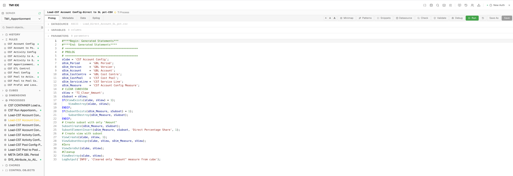
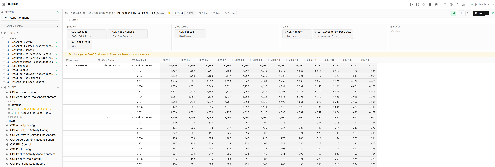
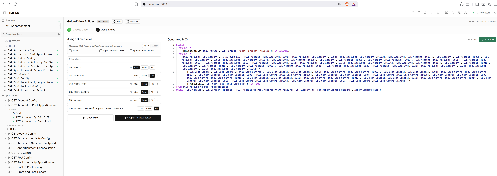
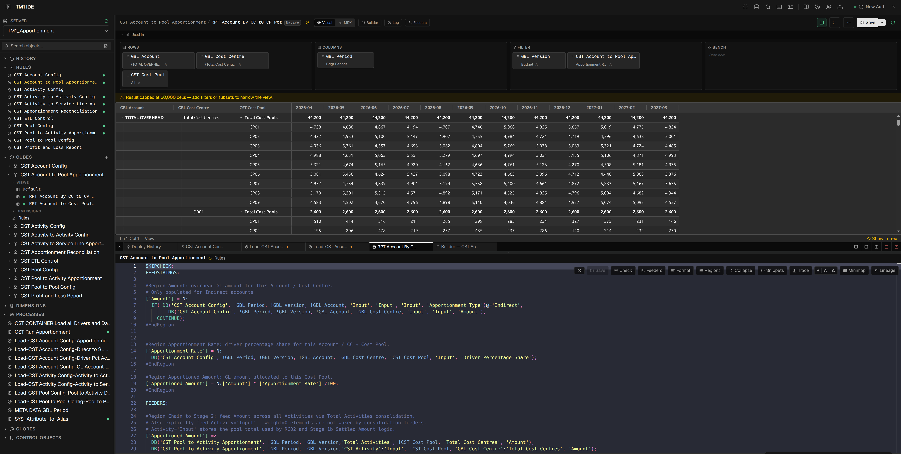

<div align="center">

# TM1 IDE

**A browser-based IDE for IBM Planning Analytics (TM1)**

[](https://nodejs.org)
[](https://opensource.org/licenses/ISC)
[](https://www.ibm.com/products/planning-analytics)
[](https://microsoft.github.io/monaco-editor/)

Edit rules, TI processes, dimensions, subsets, views, chores, and cube data — directly from your browser.  
No TM1 Architect, no Perspectives, no per-server port config.

All TM1 communication routes through **Planning Analytics Workspace (PAW)**, so there is no direct TM1 connection and no SSL to manage.

</div>

---

> [!WARNING]
> **Pre-release — for initial testing only.**
> This project is under active development and is not yet production-ready. Expect rough edges, breaking changes between commits, and features that are incomplete or unstable. Do not use in a production TM1 environment without understanding the risks.

## ⚡ Quick Start

```bash
git clone https://github.com/falconbi/tm1_ide.git
cd tm1_ide
npm install
cp .env.example .env        # edit PAW_HOST, PAW_PASSWORD, PAW_LOGIN_SERVER
npm start                   # → http://localhost:8083
```

> The frontend is pre-built — no build step needed.

---

## 📋 Table of Contents

- [Features](#-features)
- [Setup](#-setup)
- [Keyboard Shortcuts](#-keyboard-shortcuts)
- [Project Structure](#-project-structure)
- [Architecture](#-architecture)
- [Multi-User Login](#-multi-user-login)
- [Deployment Pipeline](#-deployment-pipeline)
- [IBM REST API Reference](#-ibm-rest-api-reference)

---

## 📸 Screenshots

| Rules Editor | TI Editor |
|---|---|
|  |  |

| View Editor — Native | View Editor — MDX |
|---|---|
|  |  |

**Split pane — View + Rules (dark theme)**



---

## ✨ Features

### Editors

| Editor | What it does |
|--------|-------------|
| **Rules Editor** | Monaco editor with TM1 rules syntax highlighting, live validation (CheckRules API) + static analysis (arg counts, keyword validity, line-accurate squiggles), **Check Now** button with green/red pass/fail glow, code formatter (3 structure presets), **#Region/#EndRegion folding**, lineage trace panel, **cell calculation trace** (shows full rule chain for any cell), snippet library, **Feeders** button (`tm1.CheckFeedersForRules`), **post-save reference check** (dead cube/dimension warnings as amber toasts) |
| **TI Editor** | Four-tab editor (Prolog / Metadata / Data / Epilog), parameter editor, datasource editor with CSV file upload to TM1 server, run with output log, **error log viewer** (reads TM1 `.log` file inline after errors), static analysis (IF/WHILE/FOR/NEXT block structure, arg counts), **block folding**, debugger, snippets, pattern generators, **post-save reference check**, **Validate** toolbar button — tests every `TI_CATALOG` function against the live TM1 server |
| **TI Debugger** | Set breakpoints in any section, capture variable values at each breakpoint, watch panel, section-by-section execution |
| **Dimension Editor** | Hierarchy tree with CRUD, attribute grid, element search, bulk CSV import. Per-column **→A** button converts String attributes to Alias in one click (values preserved). **Format picker** for the Format attribute with colour swatch support |
| **Subset Editor** | MDX code view + visual element tree, static/MDX save, MDX preview |
| **View Editor** | Native and MDX view builder, cell grid with inline writeback, **auto-refreshes when rules for the same cube are saved**, Feeders check, **cell right-click → Trace** side drawer |
| **Guided MDX Builder** | Axis-by-axis view builder, subset filter builder, MDX execution |
| **Chore Editor** | Schedule editor, step list, activate/deactivate/execute on demand |
| **Cube Editor** | Create and delete cubes, dimension assignment |
| **SQL Editor** | External database queries (SQL Server, PostgreSQL, MySQL, SQLite), schema browser, saved queries, post SQL as TI datasource |
| **MDX Sandbox** | Ad-hoc MDX execution with result grid |
| **Deploy Panel** | 5-step wizard: Diff → Package → Risk (drift check + BLOCKER/WARNING/INFO) → Approve → Deploy |
| **Deploy History** | Permanent archive of every deployment — approval record, manifest, results, and pre/post target snapshots with inline diff viewer |

### 🔍 Cell Trace — Right-Click → Trace

Right-clicking any cell in a view opens a popup with the cube name and element strip. Clicking **Trace** opens a 440px right-side drawer:

- **Rule statements** — each `DB()`, `ATTRN()`, `ATTRS()` call annotated with resolved live values
- **Components** — type badge (RULE / CONSOLIDATED / BASE / FEEDER) and current value per component
- **Drill-down navigation** — click any same-cube component to drill in; breadcrumb stack + Back button

### 🎨 Cell Formatting

Add a `Format` attribute (String type) to your measure dimension to control display in the View Editor:

| Format value | Effect |
| ------------ | ------ |
| `#,##0` | Integer with thousands separator |
| `#,##0.0` | One decimal place |
| `#,##0.00` | Two decimal places |
| `$#,##0` | Dollar with thousands separator |
| `#,##0.0%` | Percentage — store `0.101` → display `10.1%` |
| `#,##0.0%/100` | Percentage — store `10.1` → display `10.1%` |
| `@` | String cell — cyan (dark) / teal (light) |
| `@blue` / `@#ff0000` | String cell with named or hex colour |

### 🔎 Explorer

Browse and manage all TM1 objects: cubes, dimensions, subsets, views, processes, chores. Full CRUD for every object type — inline `+` buttons to add objects without leaving the explorer.

### 🗂️ Tabs & Split Panes

- Drag to reorder tabs within a group
- Right-click any tab: Split Right, Split Down, Move to other pane, Close others, Close to right
- Arrow button on tab hover — instantly send a tab to the other pane
- Toggle horizontal/vertical split without closing panes — direction persisted across sessions

### 🔎 Cross-Object Search

`Ctrl+Shift+F` — full-text search across all rules and TI process code on the connected server simultaneously.

### 💡 Autocomplete & Intelligence

Context-aware Monaco autocomplete across all three TM1 languages (Rules, TI, MDX):

- **Cube name / dimension name** completions with full snippet expansion and dimension tab stops
- **Function keyword completions** — correct parameter signatures from the catalog
- **Signature help** — triggered on `(`, shows param names and descriptions; active parameter highlights as you type
- **Hover docs** — hover any function name for description, param list, return type, V11/V12 compat, deprecated warnings

### 📚 Function Catalog

<details>
<summary>The intelligence layer behind completions, validation, and hover docs — click to expand</summary>

The function catalog drives autocomplete, signature help, static validation, and hover documentation. It is fully transparent and user-editable via the **book icon** in the header.

#### Catalog files

| Catalog | File | Language | Purpose |
|---------|------|----------|---------|
| `RULES_CATALOG` | `client/src/lib/tm1-completion.js` | Rules | Rich schema entries — drives completions + `rules-validator.js` |
| `TI_CATALOG` | `client/src/lib/tm1-completion.js` | TI | Rich schema entries — drives completions + `ti-validator.js` |
| `TM1_FUNCTIONS` | `client/src/lib/tm1-functions.js` | Rules + TI | Named-param signature help, Monarch highlighting |
| `MDX_CATALOG` | `client/src/lib/tm1-mdx-catalog.js` | MDX | Category-grouped MDX functions with templates |

#### Rich catalog schema

```js
DIMSIZ: {
  params:      ['dimname'],
  returnType:  'numeric',
  description: 'Returns the number of elements in a dimension.',
  compat:      'both',      // 'both' | 'v11' | 'v12'
  deprecated:  null,
  isStatement: false,
}

CELLPUTN: {
  params:      ['value', 'cubename', 'element*'],  // '*' = variadic
  returnType:  'void',
  description: 'Writes a numeric value to a cube cell.',
  compat:      'both',
  deprecated:  null,
  isStatement: true,        // cannot appear in an expression
}
```

#### What validators catch

- Unknown function name → `error` squiggle
- Wrong argument count → `error` squiggle
- `deprecated` set → `warning` squiggle with the deprecation message
- TI-only function used in Rules → `error`

#### Catalog Admin UI

The **book icon** in the header opens the Function Catalog — four tabs: TI Functions | Rules Functions | MDX Functions | Naming / Formatter.

- Edit compat, add functions, see deprecated warnings
- **Validate** button — tests every catalog entry against the live TM1 server (creates a temp process per function, deletes immediately). Results overlay ✓ / ✗ per row.
- User overrides persist to `config/function-catalog-overrides.json` — built-in catalog is never modified

</details>

---

## 🚀 Setup

### Prerequisites

- **Node.js 20+** — [nodejs.org](https://nodejs.org)
- **IBM Planning Analytics Workspace (PAW)** — V11 (native auth) or V12 (Authentik SSO)
- One or more TM1 databases registered in PAW

### 1. Install

```bash
git clone https://github.com/falconbi/tm1_ide.git
cd tm1_ide
npm install
```

> The frontend is pre-built — no `client/` install or build step needed.

### 2. Configure

```bash
cp .env.example .env
```

Edit `.env`:

```env
# PAW connection
PAW_HOST=http://192.168.x.x
PAW_USERNAME=admin
PAW_PASSWORD=your_password

# The TM1 server PAW validates logins against
# (PAW Admin Console → Configuration → TM1 Login Server URI)
PAW_LOGIN_SERVER=Production

# Server port (default: 8083)
PORT=8083

# Optional: AI-powered MDX generation
ANTHROPIC_API_KEY=sk-ant-...
```

Add your TM1 servers to `config/servers.json`. Simplest form — the IDE defaults to `paw-native` using `PAW_HOST`:

```json
[
  { "name": "Production" },
  { "name": "Development" }
]
```

### 3. Run

```bash
npm start
```

Open **[http://localhost:8083](http://localhost:8083)**

<details>
<summary>Development mode (Vite HMR)</summary>

```bash
# Terminal 1 — backend
npm start

# Terminal 2 — frontend with hot reload
cd client && npm install && npm run dev
```

Open **http://localhost:5173**

After making client changes, rebuild for production:

```bash
cd client && npm run build
cp dist/assets/index-*.js ../static/assets/
cp dist/assets/index-*.css ../static/assets/
cp dist/index.html ../static/index.html
```

</details>

---

## ⌨️ Keyboard Shortcuts

Keyboard shortcuts are available throughout the IDE. Press `F1` or `Ctrl+Shift+K` inside the app to open the full shortcut reference.

---

## 📁 Project Structure

```
tm1_ide/
├── server.js                     # Express backend — all API routes
├── core/
│   ├── tm1_client.js             # TM1 REST client (proxies through PAW)
│   ├── paw_connect.js            # PAW session auth + CSRF caching
│   ├── adapter_registry.js       # Pluggable PAW connection adapters
│   ├── sql_client.js             # External SQL connections
│   └── mdxBuilder.js             # MDX query construction helpers
├── client/                       # React + Vite frontend source
│   └── src/
│       ├── App.jsx               # Root layout, global keyboard handlers
│       ├── store/                # Zustand: tabs, server selection, UI state
│       ├── hooks/useApi.js       # All TanStack Query data hooks
│       ├── components/           # One file per editor/panel
│       └── lib/                  # Monaco languages, completions, formatters
├── static/                       # Pre-built frontend (served directly)
├── config/
│   ├── servers.json              # TM1 server list
│   ├── forge.json                # Workspace state (open tabs, server)
│   ├── sql-connections.json      # External SQL connections
│   └── sql-queries.json          # Saved SQL queries
└── docs/
    └── Planning Analytics.postman_collection.json   # IBM REST API reference
```

---

## 🏗️ Architecture

```
Browser  ←→  Express (server.js)  ←→  PAW  ←→  TM1 Server
```

- The backend never connects to TM1 directly — all calls route through PAW at `/api/v0/tm1/{server}/api/v1/`
- PAW handles TM1 authentication — the IDE authenticates with PAW using credentials in `.env`
- `core/tm1_client.js` wraps every TM1 API call — routes never call the API directly
- The frontend uses **TanStack Query** for all server state — all cache keys include the server name

---

## 👥 Multi-User Login

Multiple users can be logged in simultaneously. Each login produces an isolated session token — TM1 `}Clients` group membership controls what each user can see and do.

- Each login creates a **per-user PAW session** (UUID token, auto-refreshed on expiry)
- Each user gets their own **active change set** per server — no audit trail collisions

### Connection Adapters

| Adapter | `servers.json` key | When to use |
| ------- | ------------------ | ----------- |
| `paw-native` | `"adapter": "paw-native"` | PAW V11 or V12 with TM1 native auth. Default for plain-array `servers.json`. |
| `direct-v11` | `"adapter": "direct-v11"` | Bypass PAW — connect directly to the TM1 admin server (`HTTPPortNumber`). |
| `paw-oauth2` | `"adapter": "paw-oauth2"` | PAW V12 with Authentik/OAuth2. Uses a machine credential (client ID + secret). |

<details>
<summary>Advanced servers.json (multi-adapter / multi-PAW-host)</summary>

```json
{
  "connections": [
    {
      "name": "paw-prod",
      "adapter": "paw-native",
      "pawHost": "http://192.168.1.37",
      "loginServer": "Production",
      "servers": ["Production", "Development"]
    }
  ],
  "adminHosts": [
    {
      "adapter": "direct-v11",
      "url": "http://192.168.1.10:5895",
      "servers": ["Staging"]
    }
  ]
}
```

</details>

### PAW Login Server

PAW validates all logins against one specific TM1 server — configured in the PAW Admin Console under **Configuration → TM1 Login Server URI**. Users must exist on that server's `}Clients` to log in.

Set `loginServer` in `servers.json` (or `PAW_LOGIN_SERVER` in `.env` for the plain-array setup).

### Creating Users

Open the **User Management** panel (shield icon in the header). New users must log into the PAW workspace directly at least once to activate their workspace profile.

### Auth API

| Method | Path | Purpose |
|--------|------|---------|
| `POST` | `/api/auth/login` | Authenticate with PAW, returns session token |
| `POST` | `/api/auth/logout` | Invalidate session |
| `GET` | `/api/users` | List TM1 users |
| `POST` | `/api/users/provision` | Create user with password + groups |
| `PATCH` | `/api/users/:name` | Update user |
| `DELETE` | `/api/users/:name` | Delete user |
| `POST` | `/api/users/:name/password` | Reset password |

---

## 🚢 Deployment Pipeline

<details>
<summary>Built-in CI/CD for promoting changes from Dev to Prod — click to expand</summary>

Every save in the IDE is logged to a **Change Set** (named work session). The pipeline compares your changes against a baseline snapshot of **Prod** — not Dev — so only objects that have actually changed relative to Prod get packaged.

### Flow

```
  ① Seed baseline     ② Align Dev         ③ Work in Dev
    from Prod    ──→    to match Prod  ──→   via change set
    (snapshot)          (provision)          (IDE tracks)
                                                  │
                                                  ▼
  ④ Diff Dev vs       ⑤ Drift re-check     ⑥ Risk + Deploy
    Prod baseline ──→   Prod hasn't    ──→   to Prod
    (package)           changed?
```

### Steps

**① Seed** — snapshot Prod's object state into `.tm1baseline/snapshot.json`:
```bash
node tools/tm1deploy/bin/tm1deploy.js seed Production
```

**② Work** — click the **Clock** icon → name the change set → **Start**. Green dots appear in the Explorer sidebar on every changed object.

**③ Diff & Package** — hover the change set row in the Change Sets panel → click the green **Rocket**. The Deploy Panel opens:

| Outcome | Meaning |
|---------|---------|
| `MATCH` | Changed in Dev, verified against baseline — ready to deploy |
| `NEW` | Object exists on Dev but not in baseline |
| `DRIFT` | Dev's current state differs from the last IDE save |
| `UNCHANGED` | Same as baseline — nothing to deploy |
| `MISSING` | In baseline but not found on Dev — possibly deleted |

**④ Risk** — two phases run automatically:
1. **Drift check** — fetches current state from Prod and compares to baseline. Any drift **blocks deployment** until you re-seed.
2. **Risk analysis** (if Phase 1 is clean) — syntax, dependencies, structural impact → `BLOCKER` / `WARNING` / `INFO`

**⑤ Approve** — a named approver signs off with optional notes. Required before deployment unlocks.

**⑥ Deploy** — objects written in dependency order: attributes → dimensions → cubes → picklist cubes → rules → subsets → views → processes. Pre/post snapshots captured and stored in Deploy History.

### CLI (optional)

```bash
node tools/tm1deploy/bin/tm1deploy.js seed <prod-server>
node tools/tm1deploy/bin/tm1deploy.js diff <session-name>
node tools/tm1deploy/bin/tm1deploy.js package <session-name>
node tools/tm1deploy/bin/tm1deploy.js risk <package-dir> <target-server>
node tools/tm1deploy/bin/tm1deploy.js deploy <package-dir> <target-server>
```

</details>

---

## 📖 IBM REST API Reference

The full IBM Planning Analytics REST API is documented in [`docs/Planning Analytics.postman_collection.json`](docs/Planning%20Analytics.postman_collection.json). Covers: Dimensions, Cubes, Processes, Chores, Views/MDX, Subsets, Sessions, Transactions, Jobs, ErrorLogFiles, Metrics, Configuration, File Management, GIT integration, and PAW Workspace management.

---

## 📊 Status

Active development. Core IDE features are complete and production-stable.

---

<div align="center">
Built for the IBM Planning Analytics community · <a href="https://github.com/falconbi/tm1_ide/issues">Report an issue</a>
</div>
