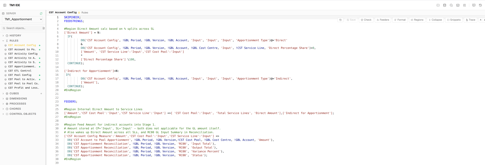
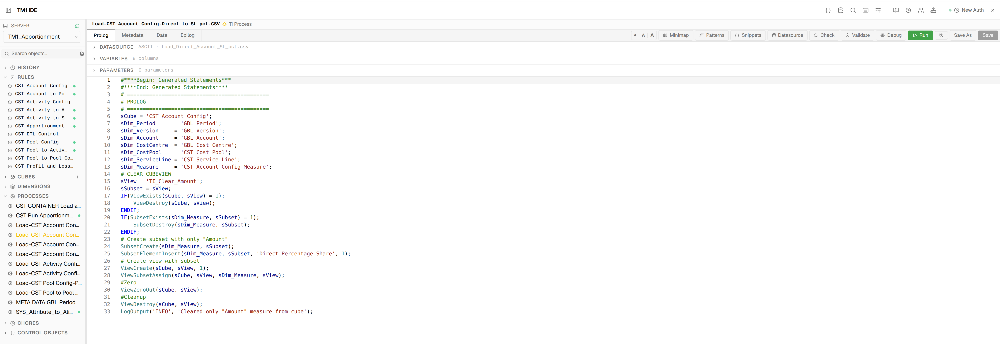
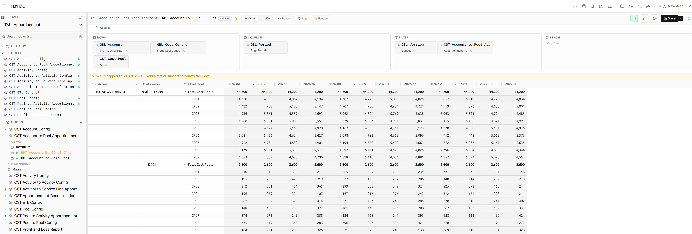
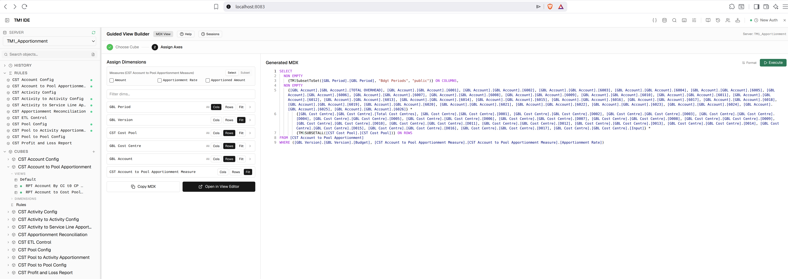
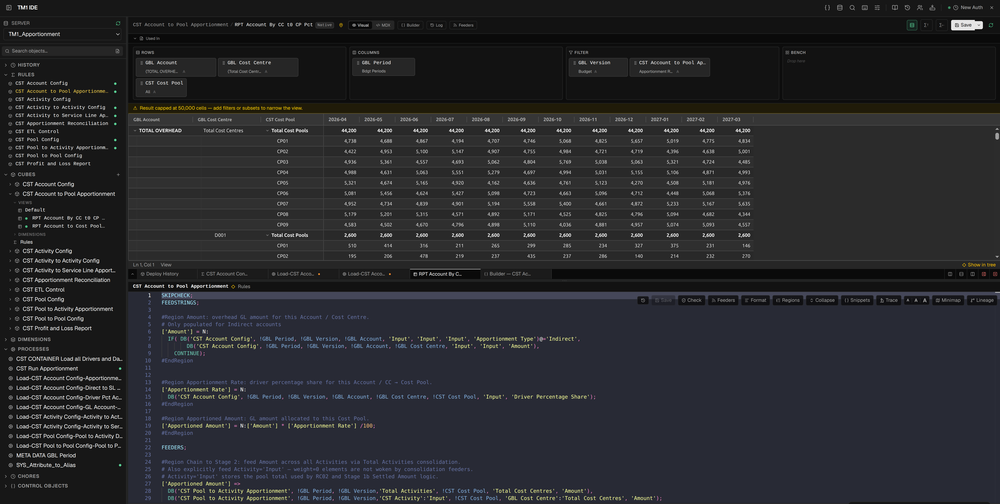
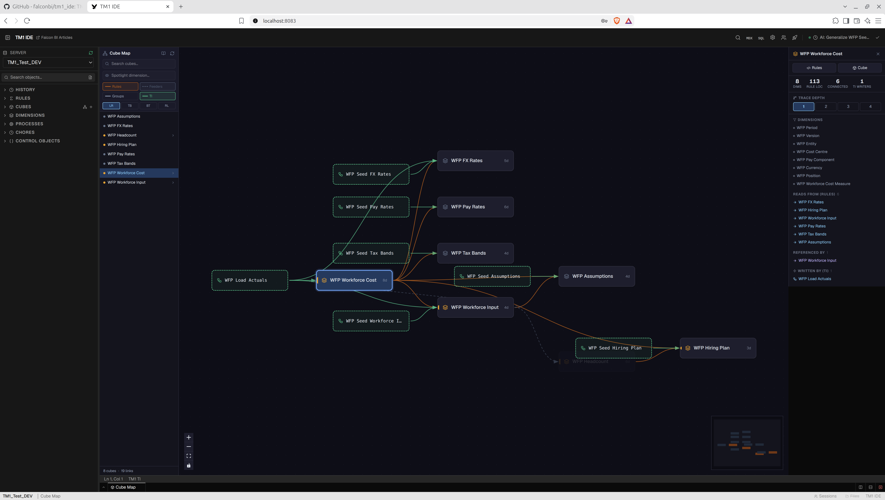
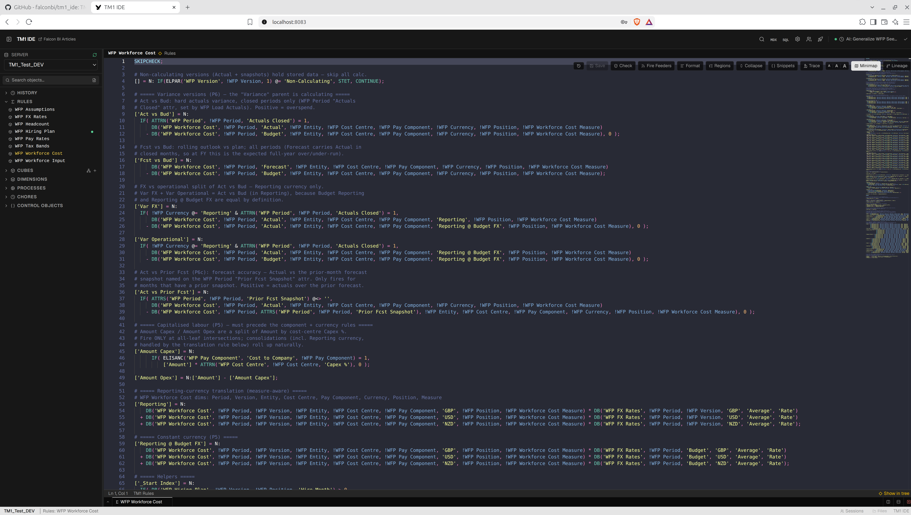
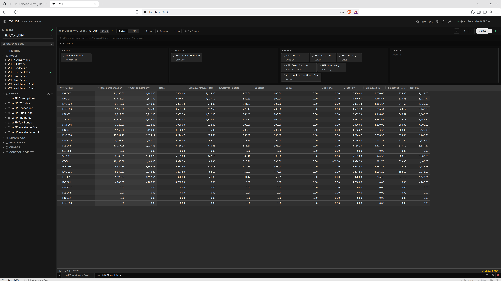
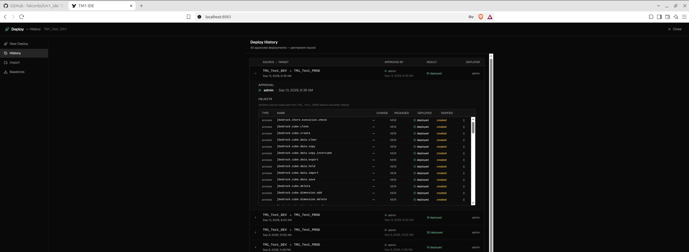
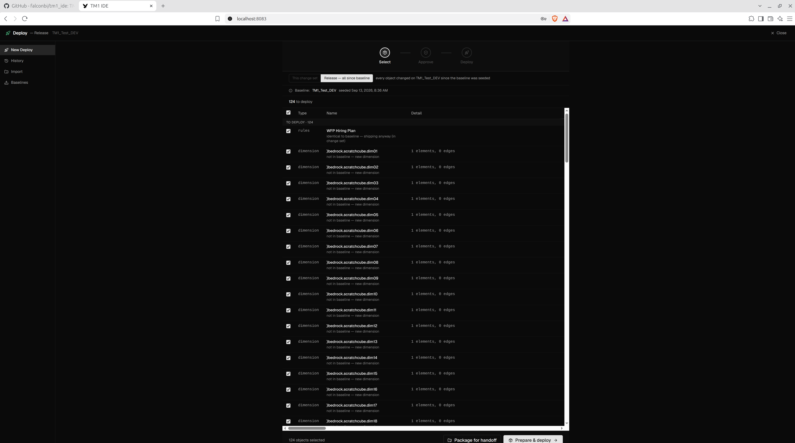

# TM1 IDE — Features

Everything the IDE does, editor by editor, with screenshots.

← [Back to README](../README.md)

---

## 📸 Screenshots

| Rules Editor | TI Editor |
|---|---|
|  |  |

| View Editor — Native | View Editor — MDX |
|---|---|
|  |  |

**Split pane — View + Rules (dark theme)**



| Cube Map | Rules Editor — Minimap + Lineage |
| --- | --- |
|  |  |

| Native View Builder | Deploy Center — History |
| --- | --- |
|  |  |

**Deploy Center — Release, all changes since baseline**



---

## 🎬 Video series

A 24-short series walking through every main feature — edit, build, govern, then automate with AI. Each short is 30–60 seconds. *(Videos are in production — expected in a few weeks. Links to be added as they're published.)*

### A. Core editing
1. The IDE in 30 seconds
2. Rules editor — write, validate, format
3. TI editor — code, run, debug
4. IntelliSense & snippets
5. Dimension editor
6. Subset editor

### B. Model & data
7. Views — native & MDX
8. Cell power — write, trace, log, notes
9. Cube Map
10. Lineage & impact analysis
11. Guided MDX builder
12. Period Builder
13. Calc Review views
14. Search, SQL, chores

### C. Deployment & governance
15. Change sets & save conflicts
16. Baselines & releases
17. Diff, drift, risk
18. Approve, deploy, verify
19. Deploy history + handoff
20. Object history, rollback, users

### D. AI & MCP
21. AI assistant (built-in) — describe a view/subset, it generates it
22. MCP — connect an external LLM (e.g. Claude Code) and it builds
23. Assertions & conventions
24. Blank server → deployed model

---

## ✨ Features

### Editors

| Editor | What it does |
|--------|-------------|
| **Rules Editor** | Monaco editor with TM1 rules syntax highlighting, live validation (CheckRules API) + static analysis (arg counts, keyword validity, line-accurate squiggles), **Check Now** button with green/red pass/fail glow, code formatter (3 structure presets), **#Region/#EndRegion folding**, lineage trace panel, **cell calculation trace** (shows full rule chain for any cell), snippet library, **Feeders** button (`tm1.CheckFeedersForRules`), **post-save reference check** (dead cube/dimension warnings as amber toasts) |
| **TI Editor** | Four-tab editor (Prolog / Metadata / Data / Epilog), parameter editor, datasource editor with CSV file upload to TM1 server, run with output log, **error log viewer** (reads TM1 `.log` file inline after errors), static analysis (IF/WHILE/FOR/NEXT block structure, arg counts), **block folding**, debugger, snippets, **post-save reference check**, **Validate** toolbar button — tests every `TI_CATALOG` function against the live TM1 server |
| **TI Debugger** | Set breakpoints in any section, capture variable values at each breakpoint, watch panel, section-by-section execution |
| **Dimension Editor** | Hierarchy tree with CRUD, attribute grid, element search, bulk CSV import. Per-column **→A** button converts String attributes to Alias in one click (values preserved). **Format picker** for the Format attribute with colour swatch support |
| **Subset Editor** | MDX code view + visual element tree, static/MDX save, MDX preview |
| **View Editor** | Native and MDX view builder, cell grid with inline writeback, **auto-refreshes when rules for the same cube are saved**, Feeders check, **cell right-click → Trace** side drawer |
| **Guided MDX Builder** | Axis-by-axis view builder, subset filter builder, and an MDX editor for ad-hoc queries with a result grid — the **MDX** icon in the toolbar |
| **Chore Editor** | Schedule editor, step list, activate/deactivate/execute on demand |
| **Cube Editor** | Create and delete cubes, dimension assignment |
| **SQL Editor** | External database queries (SQL Server, PostgreSQL, MySQL, SQLite), schema browser, saved queries, post SQL as TI datasource |
| **Cube Map** | Interactive dependency graph of the whole model — auto-laid-out (dagre) nodes for every cube, with edges for rule calc references, feeders, and TI process writes. Click a cube to highlight its full transitive dependency chain (upstream + downstream) with a count; layer toggles for Rules/Feeders/Groups/TI; auto-clusters related cubes into groups; shows the TI **writer** for a cube and, one hop further, what **calls** that writer — so a generic reusable process (e.g. a Bedrock copy utility) is correctly attributed wherever it's invoked. Open the cube, its rules, or the process straight from the node. Minimap + legend included |
| **Deploy Panel** | 5-step wizard: Diff → Package → Risk (drift check + BLOCKER/WARNING/INFO) → Approve → Deploy |
| **Deploy History** | Permanent archive of every deployment — approval record, manifest, results, and pre/post target snapshots with inline diff viewer |
| **MCP server (external LLM)** | A standard Model Context Protocol server (`tools/tm1mcp`, ~60 operations) that **external LLM agents connect to** — Claude Code or any MCP-compatible client — to build dimensions, cubes, rules and processes by conversation, change-set gated. See [`docs/MCP_SERVER.md`](MCP_SERVER.md) |
| **AI assistant (built-in)** | The IDE's inline helper generates views and subsets from a description (Anthropic API key) |

> ⚠️ **MCP is still early and needs more real-world testing** before treating it as production-hardened. It's also a genuinely different trust boundary from the rest of the IDE: pointing it at an external/third-party LLM means that LLM gets tool access to write to your TM1 model (dimensions, cubes, rules, processes) inside whatever change set is active. Review what an agent proposes before approving/deploying it, keep MCP-driven work inside change sets (never Release mode) so it's diffed like anything else, and don't point it at a server you wouldn't want an unreviewed process run against.

### Server & Operations

| Tool | What it does |
| --- | --- |
| **Change Sets** | Popup (Clock icon) listing every change set for the server — active and deployed. Expand one to see its full change log grouped by action (rules saved, process created, element renamed, etc.), open any changed object directly, view a before/after diff inline, add a note, resume a closed change set, or hit **Release** to deploy everything changed since the last baseline in one go |
| **File Manager** | Browses the TM1 server's own `Files` file space over the REST API — breadcrumb folder navigation, upload/download/delete — for managing TI datasource files without touching the OS filesystem directly |
| **Naming Dictionary** | A tab inside Catalog Admin: an editable input→output identifier map the code formatter uses to capitalise Rules/TI/MDX function names (e.g. `subnm` → `SUBNM`). Ships with IBM's default casing, supports custom entries per language, search/filter, import/export as JSON, reset to defaults |
| **Transaction Log** | Side panel showing a cube's real transaction log — timestamp, user, old value → new value — either for the whole cube or filtered to one cell intersection (e.g. from the cell right-click menu's Log tab) |
| **Jobs Monitor** | Live list of TM1 background jobs/processes on the server with status (Running/Completed/Cancelled/Aborted), auto-refreshing every 4 seconds; cancel any running job in one click |
| **Sessions Monitor** | Active TM1 sessions grouped by user, each expandable to its running threads (state + function), with per-thread cancel and per-session disconnect |
| **Server Admin** | **Admin** in the status bar. Sessions (with disconnect) and a read-only tree of the server's active configuration on every version; on V12 also a Status tab — live server metrics and the maintenance-mode toggle (TM1 12.6+). Tabs a server's version doesn't support are hidden |

### 🗓️ Period Builder

A wizard that generates a fully structured, production-ready Period dimension — elements, hierarchy, all attributes, and the three TI processes that maintain it — without writing a single line of code.

#### What it builds

For any fiscal year configuration (calendar year, April start, July start, etc.) across any year range, it generates:

#### Element structure

| Element type | Example | Purpose |
| --- | --- | --- |
| Monthly leaf | `2025-04` | Source data and reporting periods |
| FY consolidation | `FY2026` | 12-month fiscal year rollup |
| OBL leaf | `2026 OBL` | Opening balance — separate from actuals |
| YTD consolidation | `YTD FY2026 P06` | Jan–Jun accumulation for FY2026 |
| YTG consolidation | `YTG FY2026 P06` | Jul–Mar remaining months for FY2026 |
| LTD consolidation | `LTD FY2026 P06` | OBL + YTD P06 |
| Umbrella C | `All Periods`, `All FY`, `All YTD` | Cross-FY aggregations |
| Rolling (optional) | `Rolling 12`, `Rolling 6`, `Rolling 3` | Forward-rolling windows from current period |

#### Attributes per month leaf — all computed, none entered manually

| Attribute | Type | Example |
| --- | --- | --- |
| `Caption` | Alias | `Apr-25` |
| `Long Name` | String | `April 2025` |
| `Fin Year` | String | `FY2026` |
| `First Period` | String | `2025-04` |
| `Last Period` | String | `2026-03` |
| `Previous Period` | String | `2025-03` |
| `Next Period` | String | `2025-05` |
| `Calendar Year` | Numeric | `2025` |
| `Calendar Month` | Numeric | `4` |
| `Days in Period` | Numeric | `30` |
| `Period Start Serial` | Numeric | `45751` (Excel/TM1 serial) |
| `Period End Serial` | Numeric | `45780` |
| `Is Current Period` | String | `Y` / blank |
| `YTD` | String | `YTD FY2026 P01` |
| `YTG` | String | `YTG FY2026 P01` |
| `LTD` | String | `LTD FY2026 P01` |
| `Period Type` | String | `Month` / `OBL` |

#### Three generated TI processes

| Process | Parameters | What it does |
| --- | --- | --- |
| `{dim}.Build` | `pFirstFY`, `pLastFY`, `pFYStartM`, `pCurrentPeriod` | Creates (or extends) the dimension — elements, hierarchy, attributes. Idempotent — safe to re-run, only appends, never deletes. |
| `{dim}.Refresh Subsets` | `pCurrentPeriod`, `pFYStartM` | Destroys and recreates all named public subsets relative to the current period. Run monthly from a chore after rollover. |
| `{dim}.Rollover` | `pCurrentPeriod`, `pPeriod` (optional) | Advances `Is Current Period` one month forward (or jumps to a specific period if `pPeriod` is supplied), then calls `.Refresh Subsets`. |

#### Wizard inputs

- Dimension name, FY start month, first/last FY
- Year format (`FY2026` / `FY2025` / `2026`), month format (`YYYY-MM` / `Mon-YY`), caption format, long name format
- Include Total member, Include Is Current Period attribute
- Subset selector — choose which of 16 named subsets to generate (All Periods, All FY, Current FY, YTD, YTG, LTD, Rolling 12/6/3, etc.)
- Live FY boundary preview before generating — shows each FY label mapped to its calendar months

#### Subset selector

16 named subsets, each rebuilt by `.Refresh Subsets`. Eight are on by default:

| Subset | Default | Requires current period |
| --- | --- | --- |
| All Periods | ✓ | |
| All FY | ✓ | |
| Current Period | ✓ | ✓ |
| Current FY | ✓ | ✓ |
| Prior FY | ✓ | ✓ |
| YTD | ✓ | ✓ |
| YTG | ✓ | ✓ |
| LTD | ✓ | ✓ |
| Prior Period | | ✓ |
| Next FY | | ✓ |
| Prior YTD / YTG / LTD | | ✓ |
| Rolling 12 / 6 / 3 | | ✓ |

Subsets that require `Is Current Period` grey out in the selector if that attribute is not included.

> The dimension design is also available as a standalone reference — see [tm1_period_dimension](https://github.com/falconbi/tm1_period_dimension) for the Python builder and TI source files.

---

### 🔍 Cell Trace — Right-Click → Trace

Right-clicking any cell in a view opens a popup with the cube name and element strip. Clicking **Trace** opens a 440px right-side drawer:

- **Rule statements** — each `DB()`, `ATTRN()`, `ATTRS()` call annotated with resolved live values
- **Components** — type badge (RULE / CONSOLIDATED / BASE / FEEDER) and current value per component
- **Drill-down navigation** — click any same-cube component to drill in; breadcrumb stack + Back button

### 🔎 Used In — Impact Analysis

The **Used In** panel in the View Editor shows every place in your TM1 environment that references the current view or its parent cube. Click the **Used In** button in the toolbar to expand it.

The panel has two sections:

#### TI Processes

Scans all TI process code on the connected server for references to the cube or view name. Lists every process that contains a match — useful for understanding what automation will be affected before you rename or delete an object. Works with all connection adapters (`direct-v11`, `paw-native`).

#### PAW Books

Walks the PAW content tree (`/shared` and `/users`) looking for dashboards and workbenches that embed the current view. Each matching book is shown as a clickable link that opens it directly in PAW.

> **Requires paw-native.** PAW Books uses the `pacontent/v1` workspace API — a PAW-specific endpoint that has no equivalent in the TM1 REST API. When the IDE is connected via `direct-v11` (no PAW), the PAW Books section is silently suppressed. The TI Processes section still works regardless of adapter.

---

### 🎨 Cell Formatting

Add a `Format` attribute (String type) to your measure dimension to control display in the View Editor:

| Format value | Effect |
| ------------ | ------ |
| `#,##0` | Integer with thousands separator |
| `#,##0.0` | One decimal place |
| `#,##0.00` | Two decimal places |
| `$#,##0` | Dollar with thousands separator |
| `#,##0.0%` | Percentage — store `0.101` → display `10.1%` |
| `#,##0.0%/100` | Percentage — store `10.1` → display `10.1%` |
| `@` | String cell — cyan (dark) / teal (light) |
| `@blue` / `@#ff0000` | String cell with named or hex colour |

### 🔎 Explorer

Browse and manage all TM1 objects: cubes, dimensions, subsets, views, processes, chores. Full CRUD for every object type — inline `+` buttons to add objects without leaving the explorer.

### 🗂️ Tabs & Split Panes

- Drag to reorder tabs within a group
- Right-click any tab: Split Right, Split Down, Move to other pane, Close others, Close to right
- Arrow button on tab hover — instantly send a tab to the other pane
- Toggle horizontal/vertical split without closing panes — direction persisted across sessions

### 🔎 Cross-Object Search

`Ctrl+Shift+F` — full-text search across all rules and TI process code on the connected server simultaneously.

### 💡 Autocomplete & Intelligence

Context-aware Monaco autocomplete across all three TM1 languages (Rules, TI, MDX):

- **Cube name / dimension name** completions with full snippet expansion and dimension tab stops
- **Function keyword completions** — correct parameter signatures from the catalog
- **Signature help** — triggered on `(`, shows param names and descriptions; active parameter highlights as you type
- **Hover docs** — hover any function name for description, param list, return type, V11/V12 compat, deprecated warnings

### 📚 Function Catalog

<details>
<summary>The intelligence layer behind completions, validation, and hover docs — click to expand</summary>

The function catalog drives autocomplete, signature help, static validation, and hover documentation. It is fully transparent and user-editable via the **book icon** in the header.

#### Catalog files

| Catalog | File | Language | Purpose |
|---------|------|----------|---------|
| `RULES_CATALOG` | `client/src/lib/tm1-completion.js` | Rules | Rich schema entries — drives completions + `rules-validator.js` |
| `TI_CATALOG` | `client/src/lib/tm1-completion.js` | TI | Rich schema entries — drives completions + `ti-validator.js` |
| `TM1_FUNCTIONS` | `client/src/lib/tm1-functions.js` | Rules + TI | Named-param signature help, Monarch highlighting |
| `MDX_CATALOG` | `client/src/lib/tm1-mdx-catalog.js` | MDX | Category-grouped MDX functions with templates |

#### Rich catalog schema

```js
DIMSIZ: {
  params:      ['dimname'],
  returnType:  'numeric',
  description: 'Returns the number of elements in a dimension.',
  compat:      'both',      // 'both' | 'v11' | 'v12'
  deprecated:  null,
  isStatement: false,
}

CELLPUTN: {
  params:      ['value', 'cubename', 'element*'],  // '*' = variadic
  returnType:  'void',
  description: 'Writes a numeric value to a cube cell.',
  compat:      'both',
  deprecated:  null,
  isStatement: true,        // cannot appear in an expression
}
```

#### What validators catch

- Unknown function name → `error` squiggle
- Wrong argument count → `error` squiggle
- `deprecated` set → `warning` squiggle with the deprecation message
- TI-only function used in Rules → `error`

#### Catalog Admin UI

The **book icon** in the header opens the Function Catalog — four tabs: TI Functions | Rules Functions | MDX Functions | Naming / Formatter.

- Edit compat, add functions, see deprecated warnings
- **Validate** button — tests every catalog entry against the live TM1 server (creates a temp process per function, deletes immediately). Results overlay ✓ / ✗ per row.
- User overrides persist to `config/function-catalog-overrides.json` — built-in catalog is never modified

</details>

---

## ⌨️ Keyboard Shortcuts

Keyboard shortcuts are available throughout the IDE. Press `F1` or `Ctrl+Shift+K` inside the app to open the full shortcut reference.
